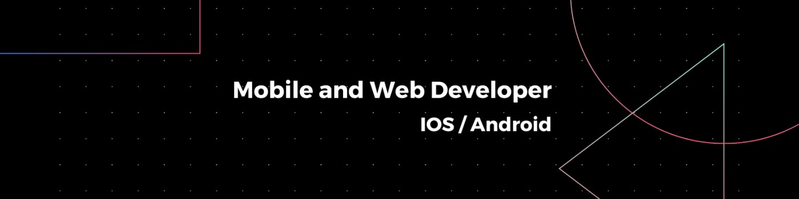
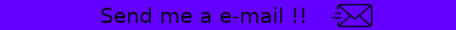

  As a fullstack mobile and web developer, I am passionate about technology and have extensive experience in creating innovative solutions. With skills in both mobile app development and web application creation, I constantly seek out challenges that allow me to explore new technologies and drive results.

  With a solid understanding of programming languages such as JavaScript, HTML, CSS, and popular frameworks like React, React Native, Node.js, and Angular, I am able to create engaging and functional user interfaces, ensuring an exceptional user experience.

  I have a practical and collaborative approach to project development, valuing effective communication and teamwork. Additionally, I stay up-to-date with the latest industry trends and best development practices to ensure my solutions align with current standards.
  My passion for technology drives me to continually seek improvement and embrace ongoing learning. I am open to new challenges and growth opportunities, always looking to expand my skills and knowledge to deliver the best possible outcome.

  I am excited to collaborate with innovative teams and be part of exciting projects that drive digital transformation. With an agile and adaptable mindset, I am ready to tackle the ever-evolving challenges of the tech world and contribute to the success of companies through my experience as a fullstack mobile and web developer.

<!-- PROGRAMMING LANGUAGES -->

    <h3 align="center">🔭 Development Tools 💬 </h3>
    
|   Languages  |    Framework   |  Databases   |  Versioning & Deploy  |    Tools    |
|    :---:     |     :---:      |    :---:     |        :---:          |    :---:    |
|   |   |   |   |  |

<!-- CONTACT -->
<h3 align="center">📫 Reach me on</h3>
  

  

    
    
Linkedin

  

  

    
    
Discord

  

  

    
    
Instagram

  

 

  

<!-- STATS

  
  

 -->
